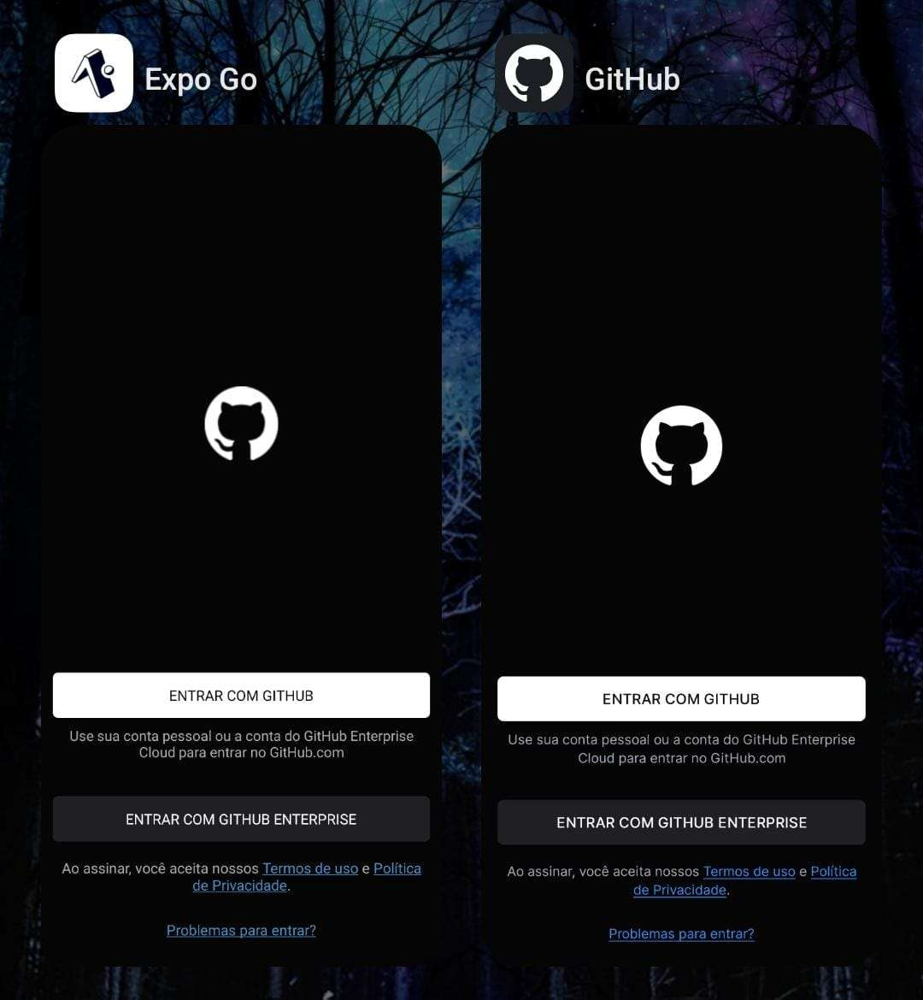

# Projeto Clone GitHub 
O projeto se trata do clone da página inicial do GitHub, onde a segunda rota se encontra no botão "Entrar com GitHub"
que direciona o usuário para uma tela de login que contém o TEXTINPUT e o TOUCHABLEOPACITY.

  

